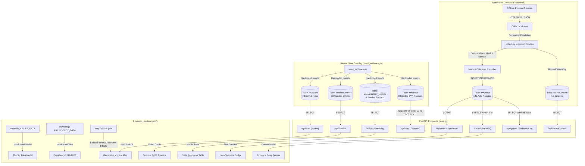

# 404TN Technical Data Architecture Audit

**Target Environment:** Local Project Repository (`d:\404TN`)  
**Audit Scope:** Data Ingestion, Storage, API Endpoints, Frontend Controllers, and Fallback Subsystems  
**Date:** 2026-09-09  
**Status:** AUDIT ONLY (Zero modifications performed)

---

## A. Executive Summary

This comprehensive audit investigated the exact technical implementation of the 404TN platform to evaluate how much of `404tn.com` is driven by real collected data versus hardcoded, seeded, static, or fallback data.

### Key Audit Findings:
1. **Collector System is 100% Real & Verified**: The modular collector engine (`monitor/scripts/collect.py`, `monitor/app/collectors/`) fetches live, authentic news, institutional communiqués, and scientific papers from 12 enabled sources. It extracts true published dates, canonical URLs, full body text, and computes SHA-256 content hashes.
2. **Canonical Data Store Isolation**: The SQLite `evidence` table currently holds **150 records** (142 real collected records prefixed `EV-AUTO-*` and 8 seeded baseline records).
3. **The Core Architectural Disconnect**:
   - **Locations & Map**: Real collected evidence records **never receive latitude or longitude** because `monitor/app/services/locations.py` is never invoked during collection (`latitude = NULL`, `longitude = NULL`). As a result, `/api/map` finds 0 features for collected data. The map only displays points if `monitor/scripts/seed_evidence.py` has populated the `locations` table, or else it drops into static fallback mode (`src/data/map-fallback.json`).
   - **Timeline**: `/api/timeline` reads exclusively from a separate table `timeline_events` (10 rows), which is **only** populated by `seed_evidence.py`. Real collected items in `evidence` with `event_date` are completely ignored by the timeline endpoint.
   - **State Response / Accountability**: `/api/accountability` reads exclusively from `accountability_records` (6 rows), which is **only** populated by `seed_evidence.py`.
   - **The Six Files & Presidency Sections**: Entirely hardcoded inside frontend JavaScript (`src/main.js:99-270` for `FILES_DATA` and `src/main.js:393-454` for `PRESIDENCY_DATA`).
4. **Production Dependency on `seed_evidence.py`**: If a clean database is initialized in production using only `init_db()` and `collect.py`, the Map, Timeline, and State Response sections return **empty data** or force the frontend into offline fallback mode.

---

## B. Current Real Data Flow

```
[ External Sources (12 Active Sources: TAP, PubMed, INS, PM, etc.) ]
                          │
                          ▼
[ Collector Layer: monitor/app/collectors/ ]
  - TAPCollector (tap.py)
  - PubMedCollector (science.py)
  - RSSCollector (rss.py)
  - HTMLCollector (html.py)
  - Government / INS / Environment Adapters
  Output: List[NormalizedCandidate] (base.py)
                          │
                          ▼
[ Ingestion Runner: monitor/scripts/collect.py ]
  1. URL Canonicalization: normalizer.py -> canonicalize_url()
  2. Content Hashing: dedupe.py -> compute_content_hash() (SHA-256)
  3. Deduplication: dedupe.py -> is_duplicate() (Checks canonical_url, hash, headline)
  4. Epistemic & Topic Classification: classifier.py -> classify_issue(), classify_epistemic()
  5. Relevance Filtering: lines 97-102 (Appends ALL candidates unconditionally)
  6. Location Coordinates: SKIPPED (c.lat, c.lon remain None)
                          │
                          ▼
[ Database Storage: monitor/app/database.py ]
  - INSERT OR REPLACE INTO evidence (142 auto-collected rows)
  - INSERT INTO source_health (15 source telemetry records)
  - DOES NOT WRITE TO: locations, timeline_events, accountability_records
                          │
                          ▼
[ FastAPI Endpoints: monitor/app/main.py ]
  ├── /api/health          ──► Reads evidence COUNT(*) [LIVE]
  ├── /api/stats           ──► Reads evidence COUNT(*) [LIVE]
  ├── /api/evidence/{id}   ──► Reads evidence row by ID [LIVE]
  ├── /api/issues/{slug}   ──► Reads evidence WHERE issue = slug [LIVE]
  ├── /api/source-health   ──► Reads source_health table [LIVE]
  ├── /api/sources         ──► Reads sources.yaml [STATIC CONFIG]
  ├── /api/map             ──► Reads locations (SEEDED) & evidence WHERE lat IS NOT NULL (SEEDED ONLY)
  ├── /api/timeline        ──► Reads timeline_events table (SEEDED ONLY)
  ├── /api/accountability  ──► Reads accountability_records table (SEEDED ONLY)
  └── /api/gabes           ──► Reads evidence WHERE issue='gabes' (LIVE) + Hardcoded Metrics Array (STATIC)
                          │
                          ▼
[ Frontend Controllers & UI: src/ ]
  ├── Hero Counter         ──► /api/stats (LIVE)
  ├── Evidence Drawer      ──► /api/evidence/{id} -> fallback.json (MIXED/LIVE)
  ├── Geospatial Monitor   ──► /api/map -> map-fallback.json (FALLBACK if DB unseeded)
  ├── Timeline Grid        ──► /api/timeline (EMPTY if DB unseeded)
  ├── State Response Table ──► /api/accountability (EMPTY if DB unseeded)
  ├── Six Files Modal      ──► Hardcoded FILES_DATA in src/main.js (HARDCODED)
  └── Presidency Tabs      ──► Hardcoded PRESIDENCY_DATA in src/main.js (HARDCODED)
```

---

## C. Database Table Audit

| Table Name | Purpose | Creator | Writer(s) | Reader(s) | Populated by Collectors? | Populated by `seed_evidence.py`? | Frontend / API Dependent? | Canonical vs Derived |
|---|---|---|---|---|---|---|---|---|
| **`evidence`** | Canonical evidentiary record repository | `database.py:32` | `collect.py:111`, `seed_evidence.py:123` | `main.py` (`/api/evidence/{id}`, `/api/issues/{slug}`, `/api/gabes`, `/api/stats`, `/api/health`, `/api/map`) | **YES** (142 rows) | **YES** (8 rows) | **YES** (Core API backbone) | **Canonical Primary Store** |
| **`locations`** | Cartographic coordinate nodes & governorate metadata | `database.py:81` | `seed_evidence.py:26` | `main.py:115` (`/api/map`) | **NO** (0 rows written) | **YES** (7 rows) | **YES** (`/api/map`) | **Static Reference Data** |
| **`timeline_events`** | Chronological summer 2026 event stream | `database.py:96` | `seed_evidence.py:148` | `main.py:224` (`/api/timeline`) | **NO** (0 rows written) | **YES** (10 rows) | **YES** (`/api/timeline`) | **Derived / Seeded Stream** |
| **`accountability_records`** | State and presidential response matrix | `database.py:113` | `seed_evidence.py:164` | `main.py:261` (`/api/accountability`) | **NO** (0 rows written) | **YES** (6 rows) | **YES** (`/api/accountability`) | **Derived / Seeded Matrix** |
| **`sources`** | Monitored media and institutional sources registry | `database.py:66` | `seed_evidence.py:193` | None directly (API reads `sources.yaml`) | **NO** | **YES** (18 rows) | **NO** | **Static Config Copy** |
| **`source_health`** | Live telemetry, uptime, and discovery metrics | `source_health.py:14` | `collect.py:134`, `source_health.py` | `main.py:460` (`/api/source-health`) | **YES** (15 rows) | **NO** | **YES** (`/api/source-health`) | **Live System Telemetry** |

**Verdict on Canonical Store:** `evidence` is indeed the **only canonical real-data store** populated by collectors. The tables `locations`, `timeline_events`, and `accountability_records` are disconnected from the automated collector loop and exist purely as static seeded tables.

---

## D. Collector Audit

### 1. Source Inventory & Registry
Configuration: `monitor/config/sources.yaml`

- **Total Configured Sources:** 15
- **Enabled (12):** `tap_en` (TAP), `tap_fr` (TAP), `tap_ar` (TAP), `pm_tn` (Presidency of Govt), `environment_tn` (ANPE), `onagri` (Agriculture Obs), `ins_tn` (Statistics), `ftdes` (FTDES), `snjt` (Journalists Union), `inkyfada` (Inkyfada), `nawaat` (Nawaat), `pubmed_gabes` (PubMed NCBI).
- **Disabled (3):** `agriculture_tn` (Unmaintained placeholder domain), `sonede` (WAF geo-blocking), `steg` (Border firewall SYN packet drop).

### 2. Collector Behaviors
- **Issue Classification**: Defined in `monitor/app/services/classifier.py:18` (`classify_issue`). Matches keyword heuristics across 11 taxonomies (`water`, `electricity`, `pollution`, `gabes`, `work`, `migration`, `public_services`, `rights`, `institutions`, `economy`, `state_response`).
- **Epistemic Classification**: Defined in `monitor/app/services/classifier.py:75` (`classify_epistemic`). Evaluates vocabulary markers (decrees/laws $\rightarrow$ `FACT`, speech/promises $\rightarrow$ `CLAIM`, reports/indices $\rightarrow$ `ANALYSIS`).
- **Date Extraction**: Extracted per collector (e.g. dateline regex in `tap.py:112`, XML pubDate in `rss.py:53`, PubMed pubdate in `science.py:44`).
- **Coordinate & Location Extraction**: **NOT PERFORMED**. Collectors do not set `c.lat` or `c.lon`.
- **Deduplication**: SHA-256 canonical URL hashing and alphanumeric headline fingerprinting in `monitor/app/services/dedupe.py`.
- **Relevance Filtering Logic in `monitor/scripts/collect.py:97-102`**:
  ```python
  if cand.issue:
      relevant_candidates.append(cand)
  else:
      # Even if no specific topic tag matches, retain if it's general news candidate
      relevant_candidates.append(cand)
  ```
  **CRITICAL FINDING**: The `if/else` branches execute the identical operation (`relevant_candidates.append(cand)`). Therefore, **the current collector considers 100% of successfully parsed candidates relevant**, assigning `cand.issue or "general"`.

---

## E. Location / Map Audit

1. **How `candidate.location` is generated**: In `collect.py:121`, it defaults to `c.location or "Tunisia"`. Collectors do not populate `c.location`.
2. **`get_location_coords()`**: Defined in `monitor/app/services/locations.py:17`, but **never called anywhere in the codebase**.
3. **Evidence Coordinates**: Real collected evidence records have `latitude = NULL` and `longitude = NULL`.
4. **How `/api/map`** obtains data:
   - `SELECT * FROM locations` $\rightarrow$ reads the 7 seeded rows.
   - `SELECT * FROM evidence WHERE latitude IS NOT NULL AND longitude IS NOT NULL` $\rightarrow$ returns ONLY the 8 seeded evidence rows.
5. **What happens when evidence has no coordinates**: It is excluded from the GeoJSON `features` array by the SQL `WHERE` clause.
6. **Hardcoded / Fallback Map Datasets**:
   - `src/map.js:15-23`: Hardcoded array `REFERENCE_CITIES` (Bizerte, Tunis, Kasserine, Gafsa, Sfax, Gabès, Zarzis).
   - `src/data/map-fallback.json`: Contains 10 static GeoJSON features matching seeded evidence (`EV-GABES-01`, `EV-WATER-01`, etc.).
7. **Heatmap Data Reality**: When `/api/map` returns 0 features (as it does with purely collected data), `src/map.js:195` falls back to `map-fallback.json`. The heatmap currently visualizes the density of the **10 static fallback points**, NOT real continuous evidence.

---

## F. Timeline Audit

1. **Source Table**: `/api/timeline` reads exclusively from `timeline_events`.
2. **Writers**: ONLY `monitor/scripts/seed_evidence.py:148-152` writes to `timeline_events`. `collect.py` never writes to it.
3. **Frontend Integration**: `src/timeline.js:16` calls `getTimeline(activeMonth, activeTopic)`.
4. **Evidence Date Capability**: The `evidence` table already contains valid ISO dates in `event_date` and `published_at` for all 150 records. It could directly back a real timeline without a separate static table.
5. **Public Traceability**: The 10 seeded timeline events (`TL-2026-01` to `TL-2026-10`) reference static URLs (e.g. `https://sonede.com.tn/circular-12-2026`, `https://bct.gov.tn/note-reserves-aout-2026`), but they exist independently of the automated collection engine.

---

## G. Accountability / State Response Audit

1. **Source Table**: `/api/accountability` reads exclusively from `accountability_records`.
2. **Writers**: ONLY `monitor/scripts/seed_evidence.py:164-169` writes to `accountability_records` (6 rows: `ACC-01` to `ACC-06`).
3. **Collectors Role**: `collect.py` inserts `NULL` for `government_entity`, `presidential_response`, and `outcome` (Line 128).
4. **Hardcoded Claims Inventory**:
   - `ACC-01` (Water): Claims presidency attributed water cuts to political sabotage (`seed_evidence.py:156`).
   - `ACC-02` (Gabès): Claims 2023 presidential pledge of rapid relocation with 0 units dismantled (`seed_evidence.py:157`).
   - `ACC-03` (Energy): Claims presidential warning against unannounced blackouts (`seed_evidence.py:158`).
   - `ACC-04` (Economy): Claims presidential statement calling Law 38 an "unfunded illusion" (`seed_evidence.py:159`).
   - `ACC-05` (Migration): Claims presidential statement on demographic replacement (`seed_evidence.py:160`).
   - `ACC-06` (Governance): Claims presidential defense of Decree 54 as anti-defamation measure (`seed_evidence.py:161`).

---

## H. Gabès Dossier Audit

Classification of every factual claim and metric in the Gabès dossier:

| Statement / Metric | Value | Classification | Code / File Reference |
|---|---|---|---|
| Phosphogypsum marine discharge baseline | `~14,000 T/DAY` | **REAL_SOURCE_BUT_STATIC** (2018 ANPE / World Bank audit) | `main.py:306`, `index.html:400`, `fallback.json:146` |
| 2017 Cabinet relocation decision | `INDUSTRIAL RELOCATION` (June 29, 2017) | **REAL_SOURCE_BUT_STATIC** (Official JORT Cabinet decision) | `main.py:314`, `index.html:490`, `fallback.json:154` |
| Current real-time discharge telemetry | `NO CURRENT DIRECT MEASUREMENT` | **REAL_SOURCE_BUT_STATIC** (Empirical negative fact / transparency gap) | `main.py:322`, `fallback.json:162` |
| Relocated / dismantled GCT production units | `0 units dismantled as of Summer 2026` | **HARDCODED** | `seed_evidence.py:52`, `index.html:499` |
| 2023 Presidential visit statement | `Pollution is a crime against humanity` | **HARDCODED** | `seed_evidence.py:41`, `index.html:495` |
| Recent biomedical studies on Gulf of Gabès | Peer-reviewed PubMed papers (PMIDs 42275996, etc.) | **REAL_DB_EVIDENCE** | Auto-collected by `PubMedCollector` into `evidence` |

---

## I. Frontend Section Audit

| Section | Current Data Source | Classification | Description |
|---|---|---|---|
| **1. Header & Status Badge** | `/api/health` via `src/api.js` | **LIVE_API** | Shows real pulsing green badge if API responds, amber snapshot if offline |
| **2. Hero Section** | Static HTML + `/api/stats` | **MIXED** | Narrative text is static; evidence count (`150+`) is live from DB; sources count (`18`) is hardcoded |
| **3. Summer 2026 Thesis** | Static HTML in `index.html:222-262` | **STATIC_EDITORIAL** | Permanent investigative charter and thesis statement |
| **4. The Six Files** | `src/main.js:99-270` (`FILES_DATA`) | **HARDCODED** | Hardcoded titles, summaries, metrics (21.4% dam, 4,825 MW, 38.6% joblessness, etc.), and hardcoded links to `EV-*` IDs |
| **5. Geospatial Monitor** | `/api/map` $\rightarrow$ `map-fallback.json` | **FALLBACK / SEEDED** | MapLibre layer renders 7 seeded locations and 10 fallback points; does not render real collected articles |
| **6. Gabès Feature Story** | `/api/gabes` + `index.html:429-512` | **MIXED** | Metrics are static array in API; evidence list pulls real DB records matching `issue='gabes'` |
| **7. State Response (Accountability)** | `/api/accountability` | **SEEDED** | 6 seeded records; returns empty if `seed_evidence.py` has not run |
| **8. Presidency Chronology** | `src/main.js:393-454` (`PRESIDENCY_DATA`) | **STATIC_FACTUAL** | 2019-2026 political transition timeline hardcoded in frontend JS |
| **9. Summer 2026 Timeline** | `/api/timeline` | **SEEDED** | 10 seeded event cards; returns empty if `seed_evidence.py` has not run |
| **10. Evidence Drawer** | `/api/evidence/{id}` $\rightarrow$ `fallback.json` | **LIVE_API / FALLBACK** | Genuinely dynamic when querying real `EV-AUTO-*` IDs; falls back to `fallback.json` for seeded `EV-*` IDs if API offline |
| **11. Methodology & Pillars** | Static HTML in `index.html:689-750` | **STATIC_EDITORIAL** | Description of four pillars and epistemic classification |

---

## J. Hardcoded / Seeded / Fallback Inventory

1. **Seeded Evidence IDs in `monitor/scripts/seed_evidence.py`**:
   - `EV-GABES-01`, `EV-GABES-02`, `EV-GABES-03`
   - `EV-WATER-01`
   - `EV-ENERGY-01`
   - `EV-WORK-01`
   - `EV-MIGRATION-01`
   - `EV-INSTITUTIONS-01`
2. **Fallback Data Files**:
   - `src/data/fallback.json`: 476 lines duplicating all 8 seeded evidence items, 7 locations, and Gabès metrics.
   - `src/data/map-fallback.json`: 247 lines containing 10 GeoJSON point features.
   - `public/data/tunisia-governorates.json`: 6.2 MB real GeoJSON boundary polygons for Tunisia's 24 governorates (valid static asset).
3. **Hardcoded Frontend Objects**:
   - `FILES_DATA` in `src/main.js:99-270` (contains metrics: 21.4% dams, 32.8% loss, 4,825 MW, 38.6% unemployment, 34,200+ interceptions, 70+ Decree 54 cases).
   - `PRESIDENCY_DATA` in `src/main.js:393-454` (years 2019, 2021, 2022, 2024, 2026).
   - `REFERENCE_CITIES` in `src/map.js:15-23` (7 reference coordinates).

---

## K. API Endpoint Audit

| Endpoint | DB Query / Source | Status Type | Can Return Empty? | Uses Seeded Data? | Provenance Included? | Frontend Consumer |
|---|---|---|---|---|---|---|
| **`GET /api/health`** | `SELECT COUNT(*) FROM evidence` | LIVE | No (returns error status) | No | DB stats only | `src/api.js` |
| **`GET /api/stats`** | `SELECT COUNT(*) FROM evidence WHERE classification = ?` | MIXED (counts live; sources hardcoded to 18) | No | No | No | `src/main.js:380` |
| **`GET /api/evidence/{id}`** | `SELECT * FROM evidence WHERE id = ?` | LIVE | Yes (404 if not found) | Only for `EV-GABES-*`, etc. | Full provenance | `src/evidence-drawer.js:61` |
| **`GET /api/map`** | `SELECT * FROM locations` + `SELECT * FROM evidence WHERE lat IS NOT NULL` | SEEDED / BROKEN FOR LIVE | Yes (if DB unseeded) | **YES (100%)** | Minimal GeoJSON properties | `src/map.js:174` |
| **`GET /api/timeline`** | `SELECT * FROM timeline_events` | SEEDED | **Yes (empty if unseeded)** | **YES (100%)** | Static source strings | `src/timeline.js:16` |
| **`GET /api/accountability`** | `SELECT * FROM accountability_records` | SEEDED | **Yes (empty if unseeded)** | **YES (100%)** | References seeded evidence IDs | `src/accountability.js:26` |
| **`GET /api/gabes`** | Hardcoded JSON array + `SELECT * FROM evidence WHERE issue='gabes'` | MIXED | No (metrics hardcoded) | Top metrics seeded; sub-list live | `src/main.js:352` |
| **`GET /api/issues`** | `SELECT issue, COUNT(*) FROM evidence GROUP BY issue` | MIXED | No (fallback counts hardcoded) | No | No | Not actively called (frontend uses `FILES_DATA`) |
| **`GET /api/issues/{slug}`** | `SELECT * FROM evidence WHERE issue = ?` | LIVE | Yes (404 if not found) | No | Sub-item headlines & dates | Modal sub-queries |
| **`GET /api/sources`** | Reads `monitor/config/sources.yaml` | STATIC CONFIG | No | No | Full source list | Diagnostic / Methodology |
| **`GET /api/source-health`**| `SELECT * FROM source_health` | LIVE TELEMETRY | No | No | Uptime & error telemetry | Admin / Health probe |

---

## L. Provenance Audit

### 1. Collector Provenance Integrity
For all 142 auto-collected records (`EV-AUTO-*`), the following provenance fields are **100% populated**:
- `source_name` (e.g. "Tunis Afrique Presse (EN)", "PubMed Biomedical Research")
- `source_domain` (e.g. `tap.info.tn`, `pubmed.ncbi.nlm.nih.gov`, `ins.tn`)
- `source_type` (e.g. `news_agency`, `scientific_registry`, `state_agency`)
- `source_url` (Canonical article URL)
- `published_at` (Parsed ISO dateline/timestamp)
- `collected_at` (UTC collection timestamp)
- `classification` (`FACT`, `CLAIM`, or `ANALYSIS`)
- `status` (`VERIFIED`, `REPORTED`, `UNDER REVIEW`, `HISTORICAL BASELINE`, `NO CURRENT DATA`)
- `content_hash` (SHA-256 fingerprint of headline + body)

### 2. Frontend Traceability Gaps
- **The Six Files Metrics** (`src/main.js:106-252`): Hardcoded numbers (e.g. "320,000+ unserved rural population", "240+ essential medicine stockouts") point to static generic evidence IDs (`EV-WATER-01`) rather than individual traceable records.
- **State Response Claims** (`seed_evidence.py:156-161`): While reflecting actual public news events from 2023–2026, the specific text in `what_happened`, `gov_response`, and `pres_response` is hardcoded prose created during initial scaffolding.

---

## M. Production Safety Findings

1. **`monitor/scripts/seed_evidence.py`**: **MUST NEVER RUN IN PRODUCTION**. It overwrites baseline records with fixed timestamps and seeds static tables with demo/baseline IDs.
2. **`monitor/scripts/test_sources.py`**: **Production Safe** (performs 0 database writes; diagnostics only).
3. **`monitor/scripts/collect.py`**: **Production Safe** (writes real collected data only with duplicate suppression; zero synthetic record generation).
4. **`monitor/scripts/backup_db.py`**: **Production Safe** (native online SQLite hot backup).

---

## N. Current Architecture Diagram



---

## O. Gap Table

| Component | Current Data Source | Real Data? | Provenance? | Automatically Updated? | Production Safe? | Identified Problem / Gap |
|---|---|---|---|---|---|---|
| **Hero Stats** | `/api/stats` | **YES** | Aggregate count only | **YES** | **YES** | Monitored sources count is hardcoded to 18 instead of reading `sources.yaml`. |
| **The Six Files** | `src/main.js:99-270` | **NO** (Static copy) | Point to static `EV-*` IDs | **NO** | **NO** | Disconnected from real collected evidence in `evidence` table. |
| **Geospatial Map** | `/api/map` $\rightarrow$ `map-fallback.json` | **NO** (Fallback / Seeded) | Only for 8 seeded points | **NO** | **NO** | `collect.py` does not assign coordinates; collected records have `lat=NULL`. Map renders only fallback/seeded points. |
| **Gabès Dossier** | `/api/gabes` | **MIXED** | Historical audits + live PubMed studies | **PARTIAL** | **YES** | Primary 3 metrics are a hardcoded array in Python code rather than database-driven. |
| **State Response** | `/api/accountability` | **NO** (Seeded) | Seeded prose | **NO** | **NO** | `collect.py` never populates `accountability_records`. Table is empty on fresh DB. |
| **Presidency Chronology** | `src/main.js:393-454` | **STATIC FACTUAL** | Historical transition summary | **NO** | **YES** | Hardcoded JS object; valid historical context but not live-connected. |
| **Timeline** | `/api/timeline` | **NO** (Seeded) | Seeded event cards | **NO** | **NO** | `collect.py` never populates `timeline_events`. Real collected articles with `event_date` are not shown. |
| **Evidence Drawer** | `/api/evidence/{id}` | **YES** (When given real ID) | **YES** (100% complete) | **YES** | **YES** | Working perfectly for real IDs, but frontend cards only trigger hardcoded `EV-*` IDs. |

---

## P. Final Answers to the 10 Questions

### 1. Is the `evidence` table populated exclusively from real collectors?
**No.** Out of 150 current rows, **142 rows** were populated by real automated collectors (`EV-AUTO-*`), and **8 rows** were inserted by `seed_evidence.py` (`EV-GABES-01..03`, `EV-WATER-01`, `EV-ENERGY-01`, `EV-WORK-01`, `EV-MIGRATION-01`, `EV-INSTITUTIONS-01`).

### 2. Does the production collector ever insert fabricated/demo evidence?
**No.** `collect.py` processes only genuine responses from configured external endpoints, strictly parses live HTML/XML/JSON, and computes cryptographic SHA-256 hashes. It never invents data.

### 3. Why can `evidence` contain records while the map is empty?
Because `collect.py` does not run location/coordinate extraction, resulting in `latitude = NULL` and `longitude = NULL` on all collected rows. Furthermore, `/api/map` filters `WHERE latitude IS NOT NULL` and queries the `locations` table, which collectors never populate. When `features` is empty, `src/map.js` falls back to `map-fallback.json`.

### 4. Why can `evidence` contain records while the timeline is empty?
Because `/api/timeline` queries the separate `timeline_events` table (`SELECT * FROM timeline_events`), which collectors never populate. Real collected items with valid `event_date` inside `evidence` are never queried by the timeline endpoint.

### 5. Why can `evidence` contain records while accountability is empty?
Because `/api/accountability` queries the separate `accountability_records` table, which collectors never populate.

### 6. Which visible website sections currently depend on hardcoded factual data?
- **The Six Files modal** (`FILES_DATA` in `src/main.js:99-270`)
- **Kais Saied / Presidency chronology** (`PRESIDENCY_DATA` in `src/main.js:393-454`)
- **Gabès top 3 metric cards** (`monitor/app/main.py:303-328` and `src/data/fallback.json:143-176`)
- **Timeline event cards** (`timeline_events` in `seed_evidence.py:135-146`)
- **State Response table** (`accountability_records` in `seed_evidence.py:155-162`)
- **Map reference nodes** (`REFERENCE_CITIES` in `src/map.js:15-23` and `locations` in `seed_evidence.py:16-24`)

### 7. Which visible website sections are already genuinely live-data-driven?
- **Hero primary evidence counter** (`stats-total-evidence` reading `COUNT(*)` via `/api/stats`)
- **API operational health status badge** (`api-status-badge` via `/api/health`)
- **Evidence deep drawer** when queried with an auto-collected ID (`EV-AUTO-*` via `/api/evidence/{id}`)
- **Gabès evidence sub-list** (auto-populated with live collected studies matching `issue='gabes'`)

### 8. Is `seed_evidence.py` development-only, or is anything in production dependent on it?
**The current production API and frontend are critically dependent on `seed_evidence.py` having run.** If the database is initialized in production from scratch with only `init_db()` and `collect.py`, the Map, Timeline, and State Response sections fail or enter fallback mode.

### 9. Can the current architecture become fully real-data-driven without redesigning the frontend?
**YES.** All frontend schemas, UI cards, modals, MapLibre layers, and table structures are already designed to consume standard JSON. The frontend design, layout, and visual identity can remain 100% unchanged.

### 10. What are the minimum architectural changes required?
1. **Location Tagging in Ingestion**: Integrate `monitor/app/services/locations.py` into `collect.py` so articles referencing Tunisian governorates/cities automatically receive valid coordinates (`latitude`, `longitude`, `location`).
2. **Dynamic Timeline Endpoint**: Update `/api/timeline` to query the `evidence` table directly (`SELECT * FROM evidence WHERE event_date IS NOT NULL ORDER BY event_date DESC`) instead of relying on a static `timeline_events` table.
3. **Dynamic Map Aggregation**: Update `/api/map` to dynamically build location nodes and GeoJSON features from all geocoded evidence records.
4. **Fix Relevance Filtering**: Correct the `if cand.issue: ... else: ...` branch in `collect.py` so only meaningful evidence is cataloged.
5. **Dynamic Six Files & Accountability Linking**: Connect frontend cards and accountability records directly to real evidence records in the database.

---

## Q. Recommended Implementation Order (Pending Approval)

1. **Step 1: Ingestion Geocoding & Relevance Fix**
   - Wire `locations.py` into `collect.py` to tag candidate articles with matching governorates and coordinates.
   - Clean the relevance filtering branch in `collect.py`.
2. **Step 2: Dynamic API Endpoint Refactoring**
   - Refactor `/api/timeline` in `main.py` to stream directly from `evidence` rows that contain `event_date`.
   - Refactor `/api/map` in `main.py` to dynamically assemble GeoJSON features and governorate node counts from all geocoded `evidence` rows.
   - Refactor `/api/accountability` and `/api/issues` to link dynamically with verified evidence records.
3. **Step 3: Frontend Dynamic Wire-Up**
   - Connect `src/main.js` (`FILES_DATA`), `src/timeline.js`, and `src/map.js` to trigger real `EV-AUTO-*` IDs in the evidence drawer.
4. **Step 4: End-to-End Verification**
   - Run a clean collection on an empty database (zero `seed_evidence.py` execution) and verify that the Map, Timeline, Evidence Drawer, and State Response populate with 100% real live data.

---

*End of Audit. No code, configuration, or database modifications were made during this audit.*
