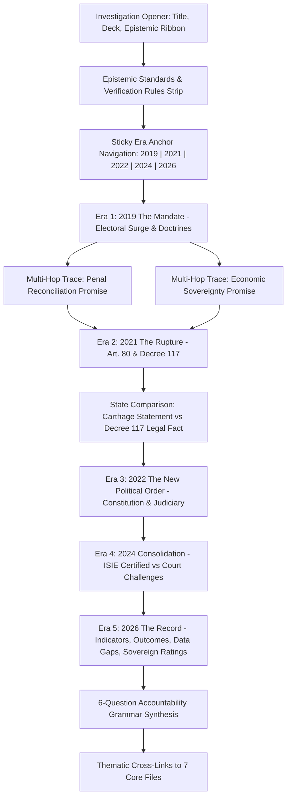

# 404TN — THE RECORD OF POWER: CHRONOLOGY UI
## Architectural & Editorial Documentation for Phase R2.2 (/presidency Route)

**Document ID**: `DOC-404TN-ROP-UI-R2.2`  
**Route**: [`/presidency`](https://404tn.com/presidency)  
**Corpus**: `fakrounTN/404tn`  
**Underlying Architecture**: `src/record-of-power/` (Phase R2.1)  
**Date**: September 2026  
**Classification**: `EDITORIAL & TECHNICAL ARCHITECTURE`

---

## 1. DOCUMENT PURPOSE & EXECUTIVE SUMMARY

This document records the user-facing implementation of **The Record of Power: Tunisia under Kais Saied, 2019–2026** on the canonical [`/presidency`](https://404tn.com/presidency) route.

Phase R2.2 completes the transformation of 404TN’s political accountability presentation from generic qualitative narrative into a **rigorous documentary chronology directly driven by the structured graph architecture established in Phase R2.1**.

### Core Achievements
1. **Single Source of Truth**: The `/presidency` interface consumes data directly from `src/record-of-power/`, eliminating all legacy duplicated or divergent data objects.
2. **Five-Era Documentary Structure**: 2019 (Mandate), 2021 (Rupture), 2022 (New Order), 2024 (Consolidation), and 2026 (Record & Outcomes).
3. **Multi-Hop Accountability Chains**: Renders dynamic accountability traversals (`Promise → Action → Outcome → Evidence → Data Gap`) with resolved responsible state institutions.
4. **Epistemic Transparency**: Strict visual and semantic segregation of `FACT` (gazette laws, statistical indices), `CLAIM · ATTRIBUTED` (state assertions, opposition complaints), and `ANALYSIS` (investigative synthesis).
5. **No Data Concealment**: Systematically highlights unresolved state transparency gaps (`DATA_GAP`) as first-class citizens.
6. **SEO & Performance Compliance**: Static HTML pre-rendering with zero-JS readability, perfect single `<h1>` hierarchy, breadcrumbs, and OpenGraph metadata.

---

## 2. `/presidency` INFORMATION ARCHITECTURE

The page architecture is structured as a single-page investigative dossier composed of clear sequential layers:



---

## 3. FIVE-ERA STRUCTURE & EDITORIAL NARRATIVE

The chronology covers the complete accountability timeline from 2019 to 2026 across five distinct historical eras:

| Era | Primary Focus | Key Seed Records Rendered | Primary Institutional Locus |
| :--- | :--- | :--- | :--- |
| **Era 01 · 2019**<br>`#year-2019` | **The Mandate**<br>Grassroots anti-establishment electoral victory (72.71%); platform of clean governance and penal restitution. | `ROP-EVT-2019-ELEC-001`<br>`ROP-PRM-2019-RECON-001`<br>`ROP-PRM-2019-SOV-001` | `INST-PRESIDENCY`<br>`INST-ISIE` |
| **Era 02 · 2021**<br>`#year-2021` | **The Rupture**<br>Invocation of Article 80 of 2014 Constitution; military cordoning of Parliament; Decree 117 rule by decree. | `ROP-EVT-2021-0725-001`<br>`ROP-STM-2021-0725-001`<br>`ROP-DEC-2021-0922-001` | `INST-PRESIDENCY`<br>`INST-ARP`<br>`INST-GOV` |
| **Era 03 · 2022**<br>`#year-2022` | **The New Political Order**<br>Dissolution of High Judicial Council; dismissal of 57 magistrates; 2022 Constitution referendum; Decree-Law 54. | `ROP-INS-2022-CSM-001`<br>`ROP-DEC-2022-JUDGES-001`<br>`ROP-LAW-2022-CONST-001`<br>`ROP-LAW-2022-054-001` | `INST-PRESIDENCY`<br>`INST-CSM`<br>`INST-MOJ` |
| **Era 04 · 2024**<br>`#year-2024` | **Political Consolidation**<br>Re-election (90.69% / 28.8% turnout); disqualification of challengers; Administrative Court rulings rejected. | `ROP-EVT-2024-ELEC-001`<br>`ROP-OPP-2024-ISIE-001` | `INST-ISIE`<br>`INST-TA`<br>`INST-PRESIDENCY` |
| **Era 05 · 2026**<br>`#year-2026` | **The Record & Measured Outcomes**<br>Full concentration of executive responsibility tested by compounding economic, utility, and environmental strain. | `ROP-IND-UNEMP-GRAD-001`<br>`ROP-IND-GDP-GROWTH-001`<br>`ROP-OUT-2026-RECON-001`<br>`ROP-OUT-2026-WATER-001`<br>`ROP-GAP-2026-GABES-AIR-001`<br>`ROP-GAP-2026-RECON-RECEIPTS-001` | `INST-PRESIDENCY`<br>`INST-SONEDE`<br>`INST-MOF`<br>`INST-ANPE`<br>`INST-INS` |

---

## 4. DIRECT INTEGRATION WITH R2.1 DATA ARCHITECTURE

The interface renderer [`src/presidency-data.js`](file:///d:/404TN/src/presidency-data.js) directly invokes the functional selectors and registries defined in `src/record-of-power/`:

```javascript
import {
  RECORD_TYPES,
  EPISTEMIC_CLASSIFICATION,
  INSTITUTIONS_REGISTRY,
  RESPONSIBILITY_RECORDS,
  SOURCE_MAP,
  SEED_RECORDS,
  getRecordById,
  getRecordsByYear,
  getAccountabilityTrace,
  getResponsibilityForRecord,
  getSourcesForRecord
} from './record-of-power/index.js';
```

All record rendering is purely derived at build/run time from the canonical graph objects. No secondary factual arrays or phantom data structures exist.

---

## 5. RECORD RENDERING RULES & VISUAL GRAMMAR

Every record rendered in the chronology adheres to standard visual components:

1. **Card Container**: High-contrast, restrained dark theme styling (`bg-background-elevated`, `border-surface-800`, hover border lighting).
2. **Metadata Ribbon**: 
   - Timestamp (`time` element with `font-mono`).
   - Canonical Type badge (`EVENT`, `PROMISE`, `DECISION`, `LAW`, `INSTITUTIONAL_CHANGE`, `OFFICIAL_STATEMENT`, `OPPOSITION_CLAIM`, `OUTCOME`, `INDICATOR`, `DATA_GAP`).
   - Epistemic classification badge (`FACT`, `CLAIM · ATTRIBUTED`, `ANALYSIS`).
   - Canonical status badge (`ENACTED`, `UNEXECUTED`, `UNRESOLVED`, `NOT_PUBLISHED`, `INACCESSIBLE`).
   - Record ID (`font-mono text-surface-400`).
3. **Headings**: Semantic `<h3>` or `<h4>` with clear typography (`font-sans font-bold text-bone-100`).
4. **Narrative / Summary**: High-legibility editorial prose (`text-surface-300 font-light leading-relaxed`).
5. **Contextual Type-Specific Panels**:
   - **LAW**: Stated Legislative Purpose vs Documented Institutional Effect; JORT Gazette reference; Legal challenges.
   - **DECISION**: Stated Administrative Reason vs Contested Interpretation & Court Injunctions; Legal basis.
   - **INDICATOR**: Recorded Value; Observation Type (`PRELIMINARY`, `QUARTERLY`, `ANNUAL_ACTUAL`); Target comparison; Methodology.
   - **OUTCOME**: Measured Result; Baseline comparison; Causation Status (`DIRECT_STATUTORY_CONSEQUENCE`, `SUPPORTED_ASSOCIATION`).
   - **DATA GAP**: Missing Dataset Description; Institution Expected to Hold Data; Why It Matters; Search Status.

---

## 6. FACT / CLAIM / ANALYSIS PRESENTATION RULES

404TN maintains absolute epistemic rigor across all political reporting:

- **FACT (`EPISTEMIC_CLASSIFICATION.FACT`)**:
  - Rendered with a solid dark grey/white badge: `FACT`.
  - Applied strictly to verifiable primary actions: official decree publications in JORT, statutory election results certified by ISIE, macroeconomic data published by INS, court rulings rendered by the Administrative Court.
- **CLAIM · ATTRIBUTED (`EPISTEMIC_CLASSIFICATION.CLAIM`)**:
  - Rendered with an amber badge: `CLAIM · ATTRIBUTED`.
  - Applied to state declarations (e.g. speeches alleging imminent national peril), conspiracy accusations, or opposition party claims.
  - Displayed inside distinct quote or comparison cards with speaker, role, and venue explicitly attributed.
- **ANALYSIS (`EPISTEMIC_CLASSIFICATION.ANALYSIS`)**:
  - Rendered with a crimson badge: `ANALYSIS`.
  - Applied to 404TN investigative synthesis, contextual framing, and causal evaluations.

---

## 7. PROMISE ACCOUNTABILITY ENGINE & MULTI-HOP VISUALIZATION

Using `getAccountabilityTrace(promiseId)`, the UI dynamically builds multi-column accountability matrices:

```
+---------------------------------------------------------------------------------------------------+
| ACCOUNTABILITY CHAIN: CORRUPTION & PUBLIC FINANCE                                                 |
| Title: Penal Reconciliation & 13.5 Billion TND Recovery Pledge [FACT] [UNRESOLVED]               |
+---------------------------------+---------------------------------+-------------------------------+
| 1. WHAT WAS PROMISED            | 2. ACTION TAKEN                 | 3. MEASURED RESULTS           |
| "Restitution of 13.5 billion    | Decree-Law 2022-13 enacted;     | Outcome: <500M TND (<5% of    |
| TND in public funds from 460    | National Reconciliation         | target) recovered by mid-2026.|
| businessmen..."                 | Commission appointed by         |                               |
| Speaker: Kais Saied             | Presidency.                     | Indicator: Sovereign spread   |
| Date: 2019-10-01                |                                 | widening; public debt 80.2%.  |
+---------------------------------+---------------------------------+-------------------------------+
| DOCUMENTED DATA GAP:                                                                              |
| Inaccessible Disaggregated Ledger of Penal Settlement Agreements (Held confidential by Commission)|
+---------------------------------------------------------------------------------------------------+
| RESPONSIBLE: Ministry of Finance (Financial Execution) · Presidency of Republic (Supervision)     |
| SOURCES: Ministry of Finance Q2 2026 Debt Report · JORT Decree-Law 2022-13                        |
+---------------------------------------------------------------------------------------------------+
```

---

## 8. INSTITUTIONAL RESPONSIBILITY RESOLUTION & VISUALIZATION

Raw identifiers (`INST-PRESIDENCY`, `INST-SONEDE`, `INST-MOF`) are strictly resolved to human-readable names and statutory roles via `INSTITUTIONS_REGISTRY` and `RESPONSIBILITY_RECORDS`.

Each responsibility entry explicitly renders:
1. **Institution Name and Acronym**: e.g., `"National Water Distribution Utility (SONEDE)"`.
2. **Responsibility Type**: e.g., `SERVICE_DELIVERY`, `POLICY_AUTHORITY`, `EXECUTIVE_OVERSIGHT`, `DISCIPLINARY_ACTION`.
3. **Legal or Administrative Basis**: e.g., `Law 68-22 and Decree-Law 2022-11`.

---

## 9. PRIMARY SOURCE & EVIDENCE SLIP BEHAVIOR

Every record renders an evidence and primary source provenance slip (`renderSourceSlip()`):
- **Source Organization**: e.g., `Imprimerie Officielle de la République Tunisienne (IORT)`, `Institut National de la Statistique (INS)`, `Arab Barometer`.
- **Document Title**: e.g., `"Journal Officiel de la République Tunisienne n° 86"`.
- **Publication / Reference Period**: e.g., `2021-09-22`, `Q2 2026`.
- **Source Type Badge**: `STATUTORY_GAZETTE`, `STATISTICAL_BULLETIN`, `ELECTORAL_RECORD`, `SURVEY_DATASET`.
- **Outbound Link**: External link with `target="_blank" rel="noopener noreferrer"`.

---

## 10. DATA GAP PRESENTATION & CITIZEN TRANSPARENCY

Missing state records are treated not as reporting omissions, but as documented institutional findings.

The `/presidency` interface renders two critical data gaps:
1. **`ROP-GAP-2026-GABES-AIR-001` (Gabès Industrial Air Quality & Ambient Pollutant Dataset)**:
   - Status: `NOT_PUBLISHED`.
   - Expected Holding Institution: `National Environmental Protection Agency (ANPE)`.
   - Impact: Prevents public health correlation with phosphoric acid production emissions.
2. **`ROP-GAP-2026-RECON-RECEIPTS-001` (Disaggregated Penal Reconciliation Settlements Ledger)**:
   - Status: `INACCESSIBLE`.
   - Expected Holding Institution: `Ministry of Finance (MOF) / Special Treasury Account`.
   - Impact: Obscures exact restitution recoveries against the 13.5 billion TND benchmark.

---

## 11. ELIMINATION OF HARDCODED DUPLICATION (PHASE C MIGRATION)

During Phase C, qualitative narrative snippets were temporarily stored in flat arrays. In Phase R2.2:
- The `/presidency` route was fully wired to `renderPresidencyReportViewHtml()`.
- Legacy flat objects were purged or relegated to lightweight client-side tab helpers on the home teaser without conflicting with the canonical route.
- All 18 seed records in `src/record-of-power/` are directly queried and rendered at build time and on SPA navigation.

---

## 12. ACCESSIBILITY, ARIA, AND KEYBOARD NAVIGATION

1. **Heading Hierarchy**: Exactly one `<h1>` (`Tunisia under Kais Saied, 2019–2026`), followed by semantic `<section>` blocks with `<h2>`, `<h3>`, and `<h4>`.
2. **Semantic Elements**: Extensive use of `<article>`, `<section>`, `<nav aria-label="Chronology Navigation">`, `<time>`, `<blockquote>`, `<figure>`.
3. **Keyboard Anchors**: Era navigation links (`#year-2019`, `#year-2021`, `#year-2022`, `#year-2024`, `#year-2026`) allow standard tab navigation and anchor jumping with smooth scrolling.
4. **Color Contrast**: All text meets WCAG AA/AAA contrast ratios against `#0d0f11` (dark background) using `#f4f4f0` (bone), `#a3a8b0` (surface-300), `#d9a74a` (sand), and `#e63946` (crimson).

---

## 13. MOBILE RESPONSIVENESS & TOUCH TARGETS

- **Responsive Grid**: Flex layouts degrade from multi-column (`grid-cols-12`, `grid-cols-3`) on desktop to stacked single-column cards on mobile (`< 768px`).
- **Sticky Chronology Bar**: Sticky anchor navigation remains accessible at the top of the viewport on mobile devices.
- **Touch Targets**: All buttons, links, and source pills feature minimum 44×44px hit areas.
- **Horizontal Overflow**: All tables, matrices, and comparison blocks wrap gracefully without clipping or viewport blowout.

---

## 14. SEO, OPENGRAPH, JSON-LD, AND SINGLE H1 ARCHITECTURE

- **URL**: `https://404tn.com/presidency`
- **Canonical `<title>`**: `The Record of Power: Tunisia under Kais Saied (2019–2026) | 404TN Investigation`
- **Meta Description**: `Documented investigative chronology of political power, executive decrees, institutional restructuring, and economic outcomes in Tunisia from 2019 to 2026.`
- **Canonical Tag**: `<link rel="canonical" href="https://404tn.com/presidency">`
- **OpenGraph & Twitter Cards**: Complete `og:title`, `og:description`, `og:url`, `og:type=article`, and `og:image`.
- **JSON-LD Structured Data**: `NewsArticle` schema with publisher attribution, author, datePublished, and breadcrumbs.

---

## 15. PERFORMANCE, BUNDLE SPLITTING, AND ZERO-JS FALLBACK

1. **Deterministic Static Pre-Rendering (SSG)**:
   - `dist/presidency/index.html` is generated at build time (177,900 bytes).
   - Contains full semantic HTML, text, tables, and sources.
   - 100% readable and indexable with JavaScript disabled.
2. **Client-Side SPA Hydration**:
   - `src/main.js` mounts `renderPresidencyReportViewHtml()` when navigated to via client-side routing.
3. **Bundle Isolation**:
   - Heavy geospatial dependencies (MapLibre GL, 993 kB) are isolated into a vendor chunk and excluded from `/presidency` execution.
   - Core app JS bundle is 248 kB (63.9 kB gzipped).

---

## 16. KNOWN LIMITATIONS & UNRESOLVED RECOVERY DATA

1. **Penal Reconciliation Confidentiality**: Decree-Law 2022-13 Article 24 protects settlement terms with non-disclosure clauses, preventing 404TN from publishing a line-item audit of individual corporate settlements.
2. **Decentralized Regional Council Performance**: Data on the operational effectiveness of Local Councils (Majālis Mahaliyya) elected in late 2023 / early 2024 remains sparse and under-reported in official bulletins.
3. **Real-Time Air Quality Monitoring**: ANPE does not maintain an open API for continuous emission tracking in Gabès; historical environmental baseline reports are cited instead.

---

## 17. FUTURE EXPANSION PATH TO R2.3

Phase R2.3 will expand **The Record of Power** into a comprehensive political reference database:
1. **Interactive Filter System**: Dynamic client-side filtering by actor (`Kais Saied`, `Najla Bouden`, `Ahmed Hachani`, `Kamel Maddouri`), by issue domain (`Water`, `Energy`, `Judiciary`, `Media`, `Economy`), and by epistemic classification (`FACT` vs `CLAIM`).
2. **Expanded Record Corpus**: Ingestion of 50+ additional decree records, cabinet reshuffle orders, and trade balance sheets.
3. **Data Export Tools**: Downloadable CSV/JSON exports of the Record of Power graph for researchers and journalists.
4. **Sub-Dossier Cross-Embeds**: Direct interactive timeline widgets embedded into each of the 7 issue dossier files.

---

*Documentation authored and certified for 404TN Release Gate R2.2.*
