# 404TN — SEO Architecture & Google Search Strategy (Revised Blueprint)

**Document Version:** 2.0.0 (Post-Audit Review & Refinement)  
**Status:** Approved Architectural Blueprint (Read-Only Planning Phase — No Implementation Yet)  
**Scope:** Technical SEO, Crawlability, Topical Authority, Indexability, Structured Data, E-E-A-T & Core Web Vitals  
**Target Platform:** 404TN (`https://404tn.com`)  
**Author:** 404TN Systems & Forensic Engineering  
**Timestamp:** 2026-09-10T22:35:00Z  

---

## 1. Executive Summary

404TN is an independent investigative documentation and evidence-monitoring platform analyzing systemic infrastructure strain, civic rights, and institutional accountability across Tunisia in 2026.

This revised document establishes the comprehensive search engine optimization (SEO) and information architecture strategy for 404TN. The primary objective is **maximum legitimate Google Search discoverability, crawl efficiency, indexation integrity, topical authority, and Core Web Vitals performance**, reinforcing journalistic rigor and forensic provenance without keyword stuffing or thin programmatic generation.

### Core Architectural Decisions
1. **Atomic Prerendering & True HTTP 404 Architecture**: 404TN will transition from a pure client-side SPA shell to a **build-time static prerendered architecture (SSG)** paired atomically with web-server configuration. Prerendered HTML files with unique metadata, semantic headings, and full text will be served with HTTP 200 for valid routes, while unknown paths will return genuine HTTP 404 status codes via Nginx/Caddy.
2. **Two-Gate Evidence Exposure Model**: Public visibility and search indexability are strictly decoupled. While all `AUTO_ACCEPTED` evidence records are publicly accessible via direct links for transparency, only substantive records meeting rigorous editorial criteria are marked `index, follow`. Thin or raw snippet records are marked `noindex, follow` to protect domain quality. `REVIEW_REQUIRED` and `REJECTED` records remain strictly private (HTTP 404).
3. **Immutable Evidence URLs (`/evidence/{id}`)**: Evidence records use stable cryptographic IDs as their permanent canonical URLs (`https://404tn.com/evidence/{id}`), avoiding slug instability caused by headline revisions or multilingual translations.
4. **Strict Launched Taxonomy & Objective Promotion Thresholds**: The seven launched dossiers (`water`, `electricity`, `gabes`, `work`, `migration`, `public-services`, `rights`) retain strict 1-to-1 canonical scopes. Unlaunched canonical V2 topics are promoted to indexable dossiers only when meeting an explicit five-part **Launch Threshold**.
5. **Deterministic, Dependency-Light SSG Build Pipeline**: Prerendering is executed via a deterministic build script (`scripts/prerender.mjs`) using Node.js and static string/DOM injection—avoiding heavy headless browser (Puppeteer/Playwright) dependencies in CI/Docker.
6. **Single Source of Truth SEO Registry**: All route metadata, titles, descriptions, canonicals, robots directives, and Schema.org types are centralized in a single configuration file (`src/seo-registry.js`).

---

## 2. Source Tree Integrity & Audit Verification

As required during the read-only audit phase, **no implementation source files, web server configurations, or database records were modified**.

### Working Tree Verification Status
- **`deploy/nginx.conf`**: Untouched.
- **`deploy/Caddyfile.example`**: Untouched.
- **`deploy/docker-compose.production.yml`**: Untouched.
- **`public/robots.txt` & `public/sitemap.xml`**: Untouched.
- **`404.html`**: Untouched.
- **Production Database (`/data/404tn.db`)**: Zero mutations, collector disabled, scheduler disabled.
- **Active Working Tree Modifications**: Confirmed limited solely to the approved Phase 2B-1 strict taxonomy contract (`monitor/app/main.py`, `monitor/app/schemas.py`, `src/main.js`, `src/utils.js`, `index.html`) and audit documentation in `docs/`.

---

## 3. Atomic Prerender & True HTTP 404 Architecture

A major vulnerability in standard SPA deployments is the **Soft-404 trap**: when an Nginx web server uses `try_files $uri $uri/ /index.html;`, every requested URL returns HTTP 200 OK with the generic SPA shell, relying on client JavaScript to display a 404 message. Search engines penalize sites exhibiting widespread soft-404s.

Conversely, changing Nginx to strict `=404` *before* pre-rendering valid routes would break direct navigation to legitimate URLs (e.g. `/gabes` or `/issues/water`).

Therefore, **Static Pre-Rendering (SSG) and True HTTP 404 Web Server Handling must be deployed as a single atomic migration**.

```mermaid
flowchart TD
    subgraph Build_Stage [1. Build-Time Static Generation (Vite + SSG)]
        Source[index.html + src/ + API Data] --> Vite[Vite Production Bundle]
        Vite --> DistOut["dist/ (JS, CSS, Assets)"]
        DistOut --> SSG[scripts/prerender.mjs]
        SSG --> Manifest[src/seo-registry.js]
        Manifest --> StaticPages["Generates:
        dist/gabes/index.html
        dist/the-files/index.html
        dist/issues/water/index.html
        dist/issues/electricity/index.html
        dist/issues/work/index.html
        dist/issues/migration/index.html
        dist/issues/public-services/index.html
        dist/issues/rights/index.html
        dist/state-response/index.html
        dist/presidency/index.html
        dist/timeline/index.html
        dist/geospatial-monitor/index.html
        dist/methodology/index.html
        dist/statement/index.html
        dist/404.html"]
    end

    subgraph Runtime_Serving [2. Atomic Runtime Web Server Handling (Nginx)]
        Req[Incoming HTTP Request] --> Match{Static file or route directory exists?}
        Match -- YES: Valid Route --> Srv200[HTTP 200 OK + Route HTML with Prerendered Head/H1/Body]
        Srv200 --> ClientHydration[Client Router Hydrates: Instant SPA Transitions]
        Match -- NO: Unknown Route --> Srv404[HTTP 404 Not Found + True 404.html Body]
    end
```

### Atomic Mechanism Specification
1. **Build Step**:
   - `npm run build` runs `vite build` followed immediately by `node scripts/prerender.mjs`.
   - The script creates dedicated static subdirectories in `dist/` containing pre-populated `index.html` files for every valid route in the SEO Registry.
   - Each generated file contains route-specific `<title>`, `<meta name="description">`, `<link rel="canonical">`, Open Graph tags, JSON-LD structured data, semantic `<h1>`, and server-rendered initial text copy.
2. **Web Server Step (`deploy/nginx.conf`)**:
   ```nginx
   # Atomic Prerender Serving Rule (No Generic SPA Catch-All)
   location / {
       # 1. Check exact static file (e.g. assets, favicon)
       # 2. Check prerendered route directory index (e.g. /gabes -> /gabes/index.html)
       # 3. Check direct HTML file
       # 4. Return true HTTP 404 for any unregistered path
       try_files $uri $uri/ $uri/index.html =404;
   }

   # Dedicated HTTP 404 Error Page
   error_page 404 /404.html;
   location = /404.html {
       root /usr/share/nginx/html;
       internal;
   }
   ```
3. **Client-Side Hydration**:
   - When a user loads `/issues/water`, Nginx immediately serves `dist/issues/water/index.html` with HTTP 200.
   - Googlebot reads complete HTML, H1, meta tags, and internal links without executing JavaScript.
   - When loaded in a browser, `src/main.js` attaches event listeners to semantic links (`<a href="...">`), enabling instant client-side transitions via the History API without page reloads.

---

## 4. Evidence Exposure Architecture: Two-Gate Model

Evidence records must not be indexed based on automated confidence thresholds alone (`confidence >= 0.85`), because confidence is an epistemic machine attribute rather than an indicator of search value or editorial depth.

We establish two independent architectural gates:

```
┌─────────────────────────────────────────────────────────────────────────────┐
│                       GATE 1: PUBLIC ACCESSIBILITY                          │
│                                                                             │
│   [AUTO_ACCEPTED]  ────────► PUBLIC (HTTP 200 via direct URL & modal)       │
│   [REVIEW_REQUIRED]────────► PRIVATE (HTTP 404 / Never Public)              │
│   [REJECTED]       ────────► PRIVATE (HTTP 404 / Never Public)              │
└──────────────────────────────────────┬──────────────────────────────────────┘
                                       │ (Only AUTO_ACCEPTED records pass to Gate 2)
                                       ▼
┌─────────────────────────────────────────────────────────────────────────────┐
│                       GATE 2: SEARCH INDEXABILITY                           │
│                                                                             │
│   Meets Substantive Content Criteria ───► <meta robots="index, follow">     │
│   Thin / Short Wire Snippet Record    ───► <meta robots="noindex, follow">   │
└─────────────────────────────────────────────────────────────────────────────┘
```

### Gate 1: Public Visibility (Security & Epistemic Guard)
- **`AUTO_ACCEPTED`**: Accessible to the public. If requested via `/evidence/{id}`, returns HTTP 200.
- **`REVIEW_REQUIRED` & `REJECTED`**: Strictly quarantined. If requested via public API or frontend URL, returns **HTTP 404 Not Found**. Never exposed in sitemaps, RSS feeds, or search indexes.

### Gate 2: Search Indexability (Editorial Quality Guard)
An `AUTO_ACCEPTED` evidence record is marked with `<meta name="robots" content="index, follow">` **only** if it satisfies all of the following objective criteria:
1. **Substantive Editorial Content**: Contains a unique headline and substantive evidence summary totaling $\ge 60$ words of verifiable factual context (not a raw 10-word news bulletin headline).
2. **Verified Source Attribution**: Published by an identifiable, trustworthy institution, news agency, or NGO (e.g. TAP, INS, ONAGRI, STEG, FTDES, SNJT) with a valid external reference URL.
3. **Canonical Categorization**: Strictly mapped to an authoritative canonical issue (e.g. `water`, `electricity`, `rights_freedoms`).
4. **Temporal & Spatial Grounding**: Contains an unambiguous publication timestamp (`published_at`) and location scope (`NATIONAL`, `GOVERNORATE`, or `LOCAL` with coordinates).
5. **Near-Duplicate Exclusion**: Content hash is verified unique; wire syndication copies across multiple agency portals are deduplicated to a single canonical record.
6. **Contextual Utility**: Directly supports an active dossier, investigation, or timeline event.

#### Thin Record Policy (`noindex, follow`)
Records that fail the substantive content threshold (e.g. single-sentence alerts, brief dispatch notices) remain **fully accessible to public users via direct link** for transparency, but are explicitly marked:
```html
<meta name="robots" content="noindex, follow">
```
This protects 404TN's domain authority from Google "thin content" demotions while preserving 100% public evidentiary auditability.

---

## 5. Permanent Evidence URL Architecture (`/evidence/{id}`)

### Architectural Evaluation: `/evidence/{id}` vs `/evidence/{id}/{slug}`

| Criteria | Minimal Form: `/evidence/{id}` (RECOMMENDED) | Slugged Form: `/evidence/{id}/{slug}` |
| :--- | :--- | :--- |
| **URL Stability** | **100% Immutable**. Database ID (e.g. `EV-AUTO-20260910-699F41`) never changes. | **Fragile**. If headline is edited, translated, or corrected, slug changes, requiring 301 redirect chains. |
| **Multilingual Integrity** | **Safe**. The cryptographic ID represents the underlying evidence event across Arabic, French, and English without transliteration errors. | **Complex**. Slug transliteration of Arabic headlines generates cumbersome or mismatched URL strings. |
| **Duplicate Content Risk** | **Zero**. Exactly one canonical URL per evidence record. | **High**. Multiple slug variations pointing to the same ID create canonical fragmentation if not aggressively 301-redirected. |
| **Search Keyword Value** | Fully addressed by page `<title>`, `<h1>`, breadcrumbs, and JSON-LD schema (Google does not require keywords in URL paths when page content is high-quality). | Marginal keyword benefit in path, heavily outweighed by maintenance overhead. |

### Recommended Canonical Policy
- **Authoritative Canonical URL**: `https://404tn.com/evidence/{evidence_id}`
- **Sitemap Inclusion**: Included in `sitemap-evidence.xml` **only** if passing Gate 2 (`index, follow`).
- **Deleted or Reclassified Records**: If a record is remediated from `AUTO_ACCEPTED` to `REJECTED` or deleted, its URL immediately responds with **HTTP 404**, and the automated sitemap generator drops it from the XML index.

---

## 6. Semantic Structured Data Matrix (Schema.org JSON-LD)

Structured data markup must reflect visible on-page content with absolute semantic accuracy. **`NewsArticle` must never be applied indiscriminately to database records**, and no fake ratings, author names, or FAQs may be fabricated.

### Page-Type to Schema.org Mapping Matrix

| Route Type | Primary Schema Type | Secondary Schema Types | Permitted Properties (Visible Data Only) | Prohibited Properties |
| :--- | :--- | :--- | :--- | :--- |
| **Homepage (`/`)** | `WebSite` | `NewsMediaOrganization` | `name`, `url`, `description`, `foundingDate`, `publishingPrinciples`, `correctionsPolicy` | Fake SearchAction without live search engine, fake ratings |
| **Index of Investigations (`/the-files`)** | `CollectionPage` | `BreadcrumbList` | `name`, `description`, `hasPart` (linking to dossiers) | `NewsArticle` |
| **Gabès Flagship (`/gabes`)** | `Report` / `Article` | `BreadcrumbList`, `Place` | `headline`, `description`, `datePublished`, `dateModified`, `publisher`, `spatialCoverage` | Unverified individual author bylines (use editorial collective) |
| **Core Issue Dossiers (`/issues/*`)** | `CollectionPage` | `BreadcrumbList`, `Report` | `name`, `description`, `about`, `publisher`, `itemListElement` | Fabricated FAQPage markup |
| **Timeline (`/timeline`)** | `CollectionPage` | `ItemList`, `BreadcrumbList` | `name`, `itemListElement` (chronological events) | `NewsArticle` on aggregate feed |
| **State Response (`/state-response`)** | `Dataset` / `CollectionPage` | `BreadcrumbList` | `name`, `description`, `variableMeasured`, `spatialCoverage` | `Review`, `AggregateRating` |
| **Geospatial Monitor (`/geospatial-monitor`)** | `Dataset` | `Place`, `BreadcrumbList` | `spatialCoverage` (Tunisia), `distribution` (GeoJSON API) | Interactive game or software markup |
| **Evidence Index (`/evidence`)** | `CollectionPage` | `DataCatalog`, `BreadcrumbList` | `name`, `description`, `dataset` | Indiscriminate article schemas |
| **Individual Evidence (`/evidence/{id}`)** | `Report` (or `NewsArticle` only if original authored journalism) | `BreadcrumbList`, `Place` | `headline`, `url`, `datePublished`, `dateModified`, `inLanguage`, `publisher`, `spatialCoverage`, `about` | Invented individual journalist bylines; fabricated review ratings |
| **Methodology (`/methodology`)** | `WebPage` | `AboutPage`, `BreadcrumbList` | `name`, `description`, `mainEntity` (verification standards) | `FAQPage` unless genuine visible FAQ accordion exists |
| **Corrections Policy (`/corrections`)** | `WebPage` | `BreadcrumbList` | `name`, `description`, `publishingPrinciples` | N/A |
| **Mission Statement (`/statement`)** | `WebPage` | `AboutPage` | `name`, `description`, `publisher` | N/A |

---

## 7. Topical Dossier Strategy & Unlaunched V2 Launch Threshold

### Launched Dossiers (Strict 1-to-1 Contract)
The seven launched investigative routes maintain strict canonical boundaries:
- `/issues/water` $\rightarrow$ `water`
- `/issues/electricity` $\rightarrow$ `electricity`
- `/gabes` (and `/issues/pollution` $\rightarrow$ 301) $\rightarrow$ `pollution_environment`
- `/issues/work` $\rightarrow$ `work_unemployment`
- `/issues/migration` $\rightarrow$ `migration`
- `/issues/public-services` $\rightarrow$ `public_services`
- `/issues/rights` (and `/issues/rights-institutions` $\rightarrow$ 301) $\rightarrow$ `rights_freedoms`

These boundaries will **never be broadened or diluted** for keyword aggregation.

### Objective Launch Threshold for Unlaunched V2 Topics
The remaining canonical Collector V2 topics (`gas_energy`, `economy_public_finance`, `prices_cost_of_living`, `food_security`, `agriculture`, `health`, `education`, `housing_infrastructure`, `media_press_freedom`, `governance_institutions`, `justice_law`, `corruption_accountability`, `security_policing`, `protests_social_movements`) will **NOT** be generated as thin SEO landing pages.

A canonical V2 topic may be promoted to an independent, indexable dossier (`/issues/{slug}`) **only when all five criteria are satisfied**:

```
┌─────────────────────────────────────────────────────────────────────────────┐
│                    NEW DOSSIER LAUNCH THRESHOLD (ALL REQUIRED)              │
├─────────────────────────────┬─────────────────────────────────────────────┤
│ 1. Evidentiary Volume       │ ≥ 15 verified AUTO_ACCEPTED evidence        │
│                             │ records in the database                     │
├─────────────────────────────┼─────────────────────────────────────────────┤
│ 2. Source Diversity         │ Primary records sourced from ≥ 3 distinct   │
│                             │ publisher domains (e.g. TAP + INS + FTDES)  │
├─────────────────────────────┼─────────────────────────────────────────────┤
│ 3. Substantive Editorial    │ Human-audited investigative overview brief  │
│    Context                  │ (≥ 400 words) detailing systemic dynamics   │
├─────────────────────────────┼─────────────────────────────────────────────┤
│ 4. Institutional Targets    │ Documented list of accountable ministries,  │
│                             │ public utilities, or state bodies           │
├─────────────────────────────┼─────────────────────────────────────────────┤
│ 5. Search Intent Durability │ Measurable public search interest in        │
│                             │ sustained systemic issues (not 24h noise)   │
└─────────────────────────────┴─────────────────────────────────────────────┘
```

---

## 8. SSG Implementation Blueprint (No Framework Migration)

To maintain 404TN's lightweight, secure, and performant stack without adopting heavy SSR frameworks (Next.js, Nuxt), static prerendering is implemented as a **build-time Node.js pipeline**.

### Selected Approach: Custom Build-Time Template Generator (`scripts/prerender.mjs`)
- **Execution**: Runs immediately after `vite build` within standard Node.js environment.
- **Mechanism**:
  1. Reads the production base template (`dist/index.html`).
  2. Reads the centralized SEO Registry (`src/seo-registry.js`).
  3. Queries local build datasets (or FastAPI endpoints) for live metrics, headlines, and evidence counts.
  4. Injects route-specific `<title>`, `<meta>`, canonical links, and Schema.org JSON-LD into `<head>`.
  5. Injects semantic server-rendered HTML (H1, brief summary, metrics grid, evidence list) into `<main id="main-content">`.
  6. Writes out static files: `dist/{route}/index.html` (e.g. `dist/gabes/index.html`, `dist/issues/water/index.html`).
- **Zero Headless Browser Overhead**: Eliminates Chromium/Playwright dependencies in Docker, keeping build times under 5 seconds and Docker images under 50MB.
- **Flawless Client Hydration**: When opened in a browser, `src/main.js` boots, intercepts link clicks, and drives dynamic filtering without visual flicker or layout shifts.

---

## 9. Centralized SEO Metadata Registry (`src/seo-registry.js`)

All metadata is governed by a single source of truth:

```javascript
// src/seo-registry.js — Centralized SEO Source of Truth
export const SEO_REGISTRY = {
  '/': {
    title: '404TN — Tunisia 2026: Investigative Documentation Platform',
    description: 'Independent investigative platform analyzing water, electricity, labor, migration, Gabès pollution, and state accountability across Tunisia in 2026.',
    canonical: 'https://404tn.com/',
    robots: 'index, follow, max-image-preview:large',
    pageType: 'website',
    h1: 'Tunisia 2026: Evidence-Based Documentation of Infrastructure & Institutional Stress',
    schemaType: 'WebSite',
    breadcrumbName: 'Home',
    sitemap: { priority: 1.0, changefreq: 'hourly', inSitemap: true },
    prerender: true
  },
  '/the-files': {
    title: 'Index of Investigations: The Six Monitored Files | 404TN',
    description: 'Explore 404TN’s ongoing forensic investigations into Tunisia’s water crisis, electrical grid, labor market, migration, public services, and civil liberties.',
    canonical: 'https://404tn.com/the-files',
    robots: 'index, follow',
    pageType: 'collection',
    h1: 'The Six Files: Monitored Systemic Pressures in Tunisia',
    schemaType: 'CollectionPage',
    breadcrumbName: 'The Files',
    sitemap: { priority: 0.9, changefreq: 'daily', inSitemap: true },
    prerender: true
  },
  '/gabes': {
    title: 'Gabès Ecological Crisis: Industrial Pollution & Phosphogypsum Dossier | 404TN',
    description: 'Forensic investigation into industrial chemical emissions, phosphogypsum marine dumping, and public health impact in Gabès, Tunisia (2017–2026).',
    canonical: 'https://404tn.com/gabes',
    robots: 'index, follow, max-image-preview:large',
    pageType: 'article',
    h1: 'Gabès: The City Paying the Price of Industrial Pollution',
    schemaType: 'Report',
    breadcrumbName: 'Gabès Investigation',
    sitemap: { priority: 0.95, changefreq: 'daily', inSitemap: true },
    prerender: true
  },
  '/issues/water': {
    title: 'Tunisia Water Crisis: Dam Reserves, SONEDE Rationing & Infrastructure | 404TN',
    description: 'Investigative documentation of Tunisia’s hydraulic deficit, reservoir saturation levels, SONEDE rationing schedules, and agricultural impact.',
    canonical: 'https://404tn.com/issues/water',
    robots: 'index, follow',
    pageType: 'article',
    h1: 'File 01: Water Deficit, Infrastructure Aging & Regional Hydraulic Stress',
    schemaType: 'Report',
    breadcrumbName: 'Water Dossier',
    sitemap: { priority: 0.9, changefreq: 'daily', inSitemap: true },
    prerender: true
  },
  '/issues/electricity': {
    title: 'Tunisia Electrical Grid: STEG Outages, Peak Demand & Energy Deficit | 404TN',
    description: 'Monitoring Tunisia’s power grid strain, peak summer load (MW), gas-fired generation capacity, and STEG load-shedding incidents.',
    canonical: 'https://404tn.com/issues/electricity',
    robots: 'index, follow',
    pageType: 'article',
    h1: 'File 02: Electrical Grid Strain, Peak Load & STEG Service Reliability',
    schemaType: 'Report',
    breadcrumbName: 'Electricity Dossier',
    sitemap: { priority: 0.9, changefreq: 'daily', inSitemap: true },
    prerender: true
  },
  '/issues/work': {
    title: 'Tunisia Labor Market & Unemployment: Youth Joblessness & Economic Strain | 404TN',
    description: 'Statistical analysis and verified evidence tracking Tunisian unemployment, graduate jobless disparities, inflation, and purchasing power.',
    canonical: 'https://404tn.com/issues/work',
    robots: 'index, follow',
    pageType: 'article',
    h1: 'File 03: Labor Market Stagnation, Unemployment & Cost of Living',
    schemaType: 'Report',
    breadcrumbName: 'Work Dossier',
    sitemap: { priority: 0.85, changefreq: 'daily', inSitemap: true },
    prerender: true
  },
  '/issues/migration': {
    title: 'Tunisia Migration Dynamics: Maritime Departures, Interceptions & Border Policy | 404TN',
    description: 'Forensic documentation of Mediterranean departure trends, interception operations, transit conditions in Sfax, and regional border policy.',
    canonical: 'https://404tn.com/issues/migration',
    robots: 'index, follow',
    pageType: 'article',
    h1: 'File 04: Mediterranean Migration Routes, Coast Guard Interceptions & Transit Realities',
    schemaType: 'Report',
    breadcrumbName: 'Migration Dossier',
    sitemap: { priority: 0.85, changefreq: 'daily', inSitemap: true },
    prerender: true
  },
  '/issues/public-services': {
    title: 'Tunisia Public Services: Healthcare, Transport & Civic Infrastructure Strain | 404TN',
    description: 'Investigating medicine supply deficits, public transit fleet reductions (Transtu/SNCFT), and municipal infrastructure failure across Tunisia.',
    canonical: 'https://404tn.com/issues/public-services',
    robots: 'index, follow',
    pageType: 'article',
    h1: 'File 05: Public Services Breakdown: Healthcare, Transit & Municipal Infrastructure',
    schemaType: 'Report',
    breadcrumbName: 'Public Services Dossier',
    sitemap: { priority: 0.85, changefreq: 'daily', inSitemap: true },
    prerender: true
  },
  '/issues/rights': {
    title: 'Tunisia Civil Liberties: Decree 54, Press Freedom & Institutional Rights | 404TN',
    description: 'Monitoring freedom of expression, Decree-Law 54 legal proceedings, journalist detentions, and judicial restructuring in Tunisia.',
    canonical: 'https://404tn.com/issues/rights',
    robots: 'index, follow',
    pageType: 'article',
    h1: 'File 06: Civil Liberties, Decree-Law 54 Proceedings & Institutional Checks',
    schemaType: 'Report',
    breadcrumbName: 'Rights & Institutions Dossier',
    sitemap: { priority: 0.85, changefreq: 'daily', inSitemap: true },
    prerender: true
  },
  '/state-response': {
    title: 'Tunisia State Response Tracker: Government Decisions, Promises & Outcomes | 404TN',
    description: 'Searchable accountability database tracking official ministerial statements, presidential decrees, implementation timelines, and documented outcomes.',
    canonical: 'https://404tn.com/state-response',
    robots: 'index, follow',
    pageType: 'dataset',
    h1: 'State Response & Accountability Tracker: Promises vs Documented Outcomes',
    schemaType: 'Dataset',
    breadcrumbName: 'State Response',
    sitemap: { priority: 0.85, changefreq: 'daily', inSitemap: true },
    prerender: true
  },
  '/presidency': {
    title: 'Kais Saied Presidency (2019–2026): Power Concentration & Crisis Governance | 404TN',
    description: 'Documentary chronology analyzing executive governance, institutional consolidation, and presidential management of Tunisia’s national crises.',
    canonical: 'https://404tn.com/presidency',
    robots: 'index, follow',
    pageType: 'article',
    h1: 'The Presidency (2019–2026): Executive Authority & Crisis Management',
    schemaType: 'Report',
    breadcrumbName: 'Presidency Chronology',
    sitemap: { priority: 0.85, changefreq: 'weekly', inSitemap: true },
    prerender: true
  },
  '/timeline': {
    title: 'Summer 2026 Incident Chronology: Verified Events & Telemetry Stream | 404TN',
    description: 'Day-by-day chronological documentation of water cuts, power outages, protests, maritime interceptions, and official actions across Tunisia.',
    canonical: 'https://404tn.com/timeline',
    robots: 'index, follow',
    pageType: 'collection',
    h1: 'Summer 2026 Chronology: Day-by-Day Documented Incidents',
    schemaType: 'CollectionPage',
    breadcrumbName: 'Timeline',
    sitemap: { priority: 0.85, changefreq: 'hourly', inSitemap: true },
    prerender: true
  },
  '/geospatial-monitor': {
    title: 'Tunisia Geospatial Evidence Monitor: 24-Governorate Incident Mapping | 404TN',
    description: 'Interactive vector map projecting verified evidence records across Tunisia’s 24 governorates. Visualizing documented evidence density.',
    canonical: 'https://404tn.com/geospatial-monitor',
    robots: 'index, follow',
    pageType: 'application',
    h1: 'Geospatial Monitor: 24-Governorate Verified Evidence Projection',
    schemaType: 'Dataset',
    breadcrumbName: 'Geospatial Monitor',
    sitemap: { priority: 0.8, changefreq: 'daily', inSitemap: true },
    prerender: true
  },
  '/evidence': {
    title: 'Primary Evidence Archive: Sourced Records & Forensic Verification | 404TN',
    description: 'Authoritative archive of verified evidence records, official datasets, public statements, and corroborated investigative documentation.',
    canonical: 'https://404tn.com/evidence',
    robots: 'index, follow',
    pageType: 'collection',
    h1: 'Primary Evidence Archive: Verifiable Datasets & Cryptographic Provenance',
    schemaType: 'CollectionPage',
    breadcrumbName: 'Evidence Archive',
    sitemap: { priority: 0.8, changefreq: 'daily', inSitemap: true },
    prerender: true
  },
  '/methodology': {
    title: 'Investigative Methodology & Verification Standards | 404TN',
    description: 'Methodological protocol governing 404TN’s three-tier epistemic classification, location confidence scoring, source verification, and ethics.',
    canonical: 'https://404tn.com/methodology',
    robots: 'index, follow',
    pageType: 'website',
    h1: 'Investigative Methodology, Verification Protocol & Epistemic Standards',
    schemaType: 'WebPage',
    breadcrumbName: 'Methodology',
    sitemap: { priority: 0.7, changefreq: 'monthly', inSitemap: true },
    prerender: true
  },
  '/statement': {
    title: 'Mission Statement: Independent Documentation Standards | 404TN',
    description: 'Editorial statement on evidence-first journalism, institutional memory, independence from political funding, and documentation standards.',
    canonical: 'https://404tn.com/statement',
    robots: 'index, follow',
    pageType: 'website',
    h1: 'Mission Statement: Why 404TN Documents Systemic Strain',
    schemaType: 'WebPage',
    breadcrumbName: 'Mission Statement',
    sitemap: { priority: 0.6, changefreq: 'monthly', inSitemap: true },
    prerender: true
  }
};
```

---

## 10. Core Web Vitals & Lazy Hydration Performance Plan

MapLibre GL is a powerful cartographic tool, but its standalone JavaScript bundle (`993 kB`) poses a substantial Core Web Vitals risk if loaded synchronously on initial page arrival.

### Performance Plan Specifications
1. **Lazy Map Initialization**:
   - The MapLibre GL bundle (`vendor-maplibre-*.js`) is dynamically imported (`import('./map.js')`) **only** when `#geospatial-map-container` intersects the viewport via `IntersectionObserver`.
   - On routes that do not display the map (e.g. `/issues/water`, `/methodology`, `/state-response`), MapLibre GL is **never downloaded**, reducing initial JavaScript payload from ~1.1MB to under 75kB.
2. **Zero Cumulative Layout Shift (CLS = 0.00)**:
   - All dynamic elements (map container, metric cards, timeline event stream, accountability rows) have explicit CSS minimum heights:
     - `#geospatial-map-container` $\rightarrow$ `min-h-[440px]`
     - Metric cards $\rightarrow$ `min-h-[110px]`
     - Dossier modals $\rightarrow$ `min-h-[400px]`
3. **Font Rendering Optimization**:
   - Standardize `font-display: swap` on all web font imports, pairing them with size-adjusted system fallback definitions to eliminate layout reflow during font swap.
4. **Target Performance Budget**:
   - **LCP (Largest Contentful Paint)**: $< 1.0\text{s}$ (Target: $650\text{ms}$ on static HTML).
   - **INP (Interaction to Next Paint)**: $< 50\text{ms}$.
   - **CLS (Cumulative Layout Shift)**: $0.00$.
   - **Lighthouse Performance Score**: $\ge 95$ (Mobile & Desktop).

---

## 11. Google News & Discover Readiness (Technical Specifications)

*Note: Inclusion in Google News and Google Discover is subject to Google's algorithmic and editorial policies. No automated implementation guarantees inclusion. 404TN establishes full compliance with technical prerequisites.*

### Architectural Separation
- **General Google Search SEO**: Focuses on evergreen topical authority, keyword relevance, and static indexability across issue dossiers and evidence records.
- **Google News Technical Readiness**:
  - Requires clean, static HTML containing verified publication timestamps (`<time datetime="...">`) and unmodified source attribution.
  - Sourced evidence items published within $\le 48\text{ hours}$ can be aggregated into a dynamic `sitemap-news.xml`.
  - Organization transparency: Clear masthead, editorial standards, and contact desk published on `/statement` and `/methodology`.
- **Google Discover Readiness**:
  - Requires `<meta name="robots" content="max-image-preview:large">` in `<head>`.
  - High-resolution editorial Open Graph imagery ($\ge 1200\text{px}$ width) generated per dossier and investigation.
  - Highly factual, descriptive titles summarizing empirical findings rather than engagement bait.

---

## 12. SEO Implementation Gates

Implementation of this architecture will follow a strictly sequenced 12-gate progression. **No gate may begin until its preceding gate is verified and approved.**

```mermaid
graph LR
    G1[Gate 1: Taxonomy] --> G2[Gate 2: Registry]
    G2 --> G3[Gate 3: SSG Build]
    G3 --> G4[Gate 4: True 404]
    G4 --> G5[Gate 5: Metadata]
    G5 --> G6[Gate 6: Schema JSON-LD]
    G6 --> G7[Gate 7: Sitemap & Robots]
    G7 --> G8[Gate 8: Internal Links]
    G8 --> G9[Gate 9: Evidence URLs]
    G9 --> G10[Gate 10: CWV & Mobile]
    G10 --> G11[Gate 11: Prod Validation]
    G11 --> G12[Gate 12: Search Console]
```



### Detailed Gate Specifications

| Gate ID | Title & Scope | Files Affected | Automated Validation Tests | Rollback Risk | Dependencies |
| :--- | :--- | :--- | :--- | :--- | :--- |
| **Gate 1** | **Taxonomy & Data Contract Integrity** | `monitor/app/main.py`, `monitor/app/schemas.py` | `python -m unittest monitor/tests/test_phase2b_taxonomy_contract.py` (Assert 10/10 PASS) | Very Low | None (Phase 2B-1 baseline verified) |
| **Gate 2** | **Centralized Route SEO Registry** | `src/seo-registry.js`, `src/router.js` | Unit test validating complete metadata fields for all 16 static routes | Very Low | Gate 1 |
| **Gate 3** | **SSG Prerender Build Pipeline** | `scripts/prerender.mjs`, `package.json`, `vite.config.js` | `npm run build` generates 16 HTML directories in `dist/` containing non-empty H1 and meta tags | Low | Gate 2 |
| **Gate 4** | **Atomic True HTTP 404 & Nginx Routing** | `deploy/nginx.conf`, `404.html` | Integration test: Valid route returns 200 + prerendered HTML; `/invalid-xyz` returns true HTTP 404 | Low | Gate 3 |
| **Gate 5** | **Dynamic & Static Canonical / Meta Injection** | `scripts/prerender.mjs`, `src/router.js` | HTML parser assertion verifying unique title, description, and canonical on every prerendered file | Very Low | Gate 3, Gate 4 |
| **Gate 6** | **Semantic Schema.org JSON-LD Pipeline** | `scripts/prerender.mjs`, `index.html` | Google Rich Results Test validation against generated HTML for all page types | Very Low | Gate 5 |
| **Gate 7** | **Authoritative Sitemap & Robots.txt Deployment** | `public/sitemap.xml`, `public/robots.txt`, `scripts/generate-sitemap.mjs` | XML Schema validation for sitemap; robots.txt syntax validator | Very Low | Gate 4, Gate 5 |
| **Gate 8** | **Semantic Internal Linking & Anchor Refactor** | `index.html`, `src/main.js` | DOM test asserting all `.file-row` and dossier cards use semantic `<a href="...">` | Very Low | Gate 3 |
| **Gate 9** | **Permanent Evidence URL Pilot (`/evidence/{id}`)** | `scripts/prerender-evidence.mjs`, `src/router.js`, `monitor/app/main.py` | Test asserting `AUTO_ACCEPTED` returns 200, `REVIEW_REQUIRED`/`REJECTED` returns 404, thin records get `noindex` | Medium | Gate 4, Gate 5 |
| **Gate 10** | **Core Web Vitals & Lazy Hydration Optimization** | `src/map.js`, `src/main.js`, `src/style.css` | Lighthouse CLI audit: LCP $< 1.2\text{s}$, CLS $= 0.00$, SEO Score $= 100$ | Low | Gate 8 |
| **Gate 11** | **End-to-End Production & Staging Validation** | Staging environment, Docker production container | Full curl matrix verifying status codes, headers, compression, and CSP headers | Low | Gate 10 |
| **Gate 12** | **Google Search Console Submission & Monitoring** | Google Search Console API / Dashboard | Verification of sitemap fetch, zero soft-404 indexation errors, crawl inspection | None | Gate 11 |

---

*End of Revised 404TN SEO Architecture & Google Search Strategy Blueprint.*
